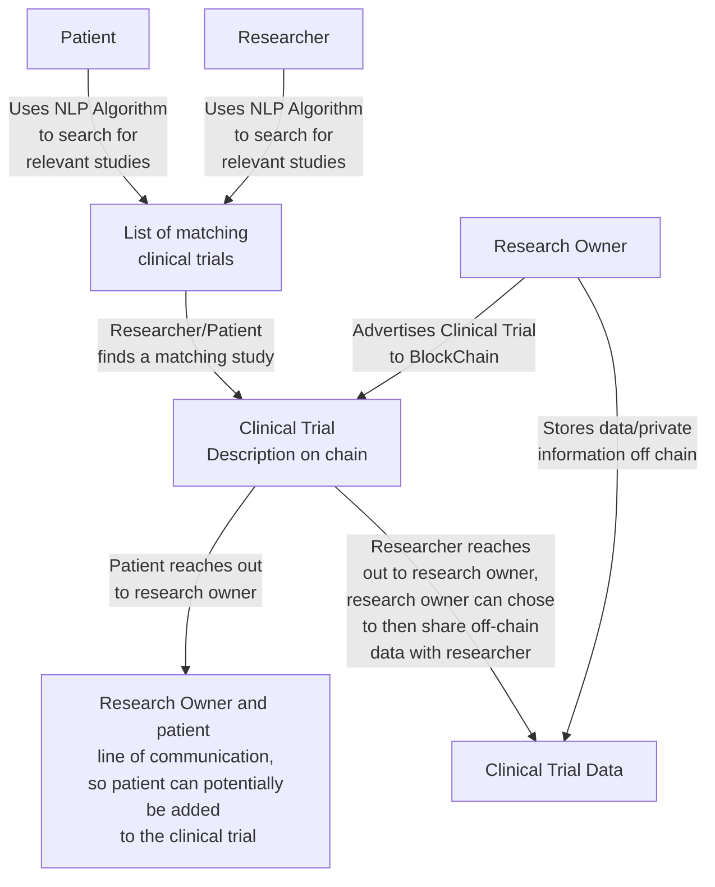

# S22_StudyBlock
Project Description: 
To create a platform that allows cancer researchers and patients to be matched
to clinical trials and research studies according to their needs to help
further improve patient and researcher access to clinical trials and research
studies which in turn benefits the trials and studies as well. The project will
use AI to provide matches for researchers and patients. The project will require
blockchain in order for patients and/or researchers to be able to contact the 
point of contact of the clinical trials or research studies where there can also 
be a safe medium of private data exchange if need be.

# StudyBlock User Work Flow

