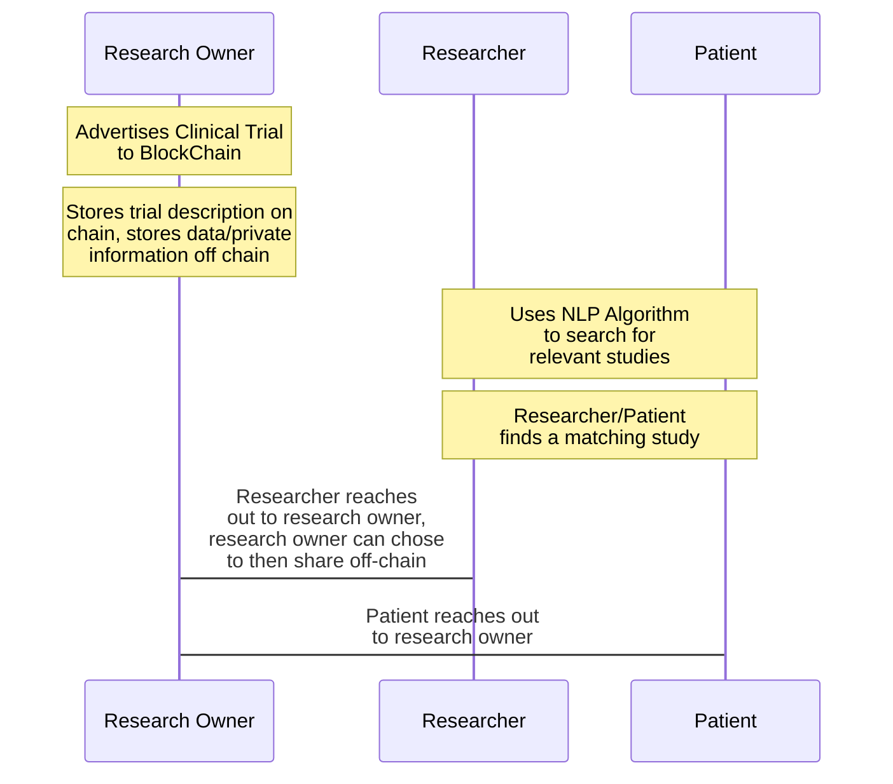
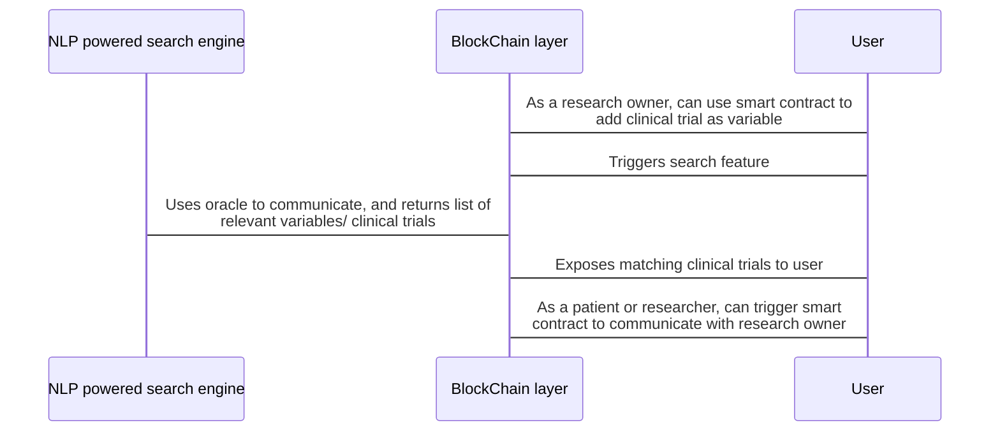

# S22_StudyBlock
# Project Description 
To create a platform that allows cancer researchers and patients to be matched to clinical trials and research studies according to their needs. The project will use AI to provide matches for researchers and patients. The project will require blockchain in order for patients and/or researchers to be able to contact the point of contact of the clinical trials or research studies where there can also be a safe medium of private data exchange if need be.

# Motivation
Improve patient and researcher access to clinical trials and research studies which in turn benefits the trials and studies as well.

# Final Goal
To allow patients and researchers to be matched with clinical trials that match their needs and to allow researchers to negotiate for clinical research data on the blockchain.

# User Stories
As a breast cancer patient, I want to be able to further look into the effects and results of a clinical trial to find the one that best suits my needs. 

As a researcher, I want to find clinical trial data related to my current study to help support my current research.

# StudyBlock User Work Flow

# StudyBlock Architecture

